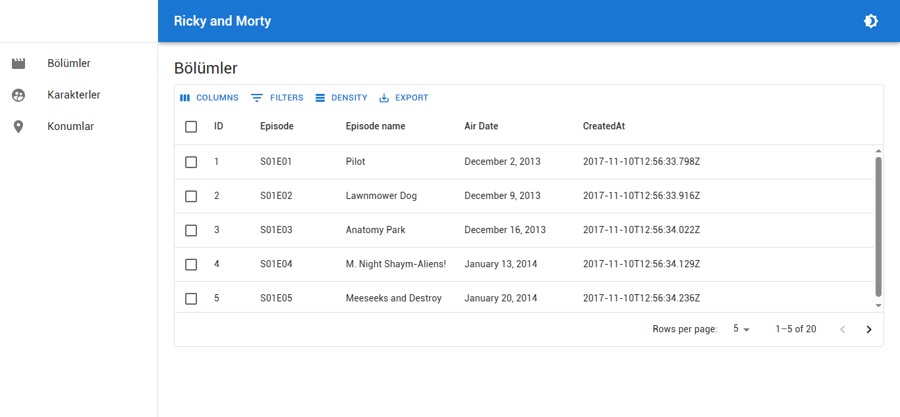

# mui-pankod-superplate

> Craco, **Material UI**, GraphQL, React Router v5, i18n, DarkMode



This simple dashboard template for react was generated with [superplate](https://github.com/pankod/superplate). You can initiate this project with [Ionic](https://ionicframework.com/docs/react/adding-ionic-react-to-an-existing-react-project) to support Android, iOS, Desktop, and PWA. You can switch to any package manager without worrying about lock files.

## Getting Started with Docker

### Build the image.

```bash
	docker build -t mui-pankod-superplate .
```

### Run container.


```bash
	docker run -p 3000:3000 mui-pankod-superplate
```

## Getting Started without Docker

### Running the development server.

```bash
    pnpm dev
```

### Building for production.

```bash
    pnpm build
```

### Running the production server.

```bash
    pnpm start
```

## Learn More

To learn more about **superplate**, please check out the [Documentation](https://github.com/pankod/superplate).


## License

Licensed under the MIT License
